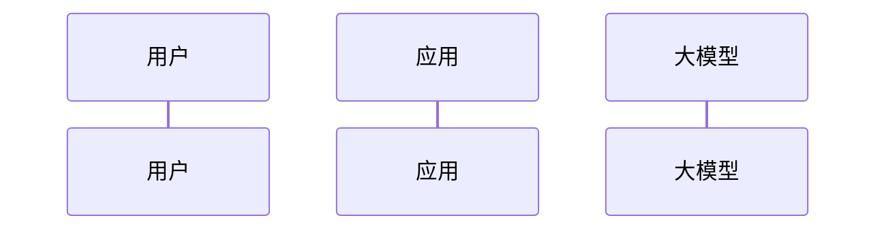

# Report Templates

Use these templates for the files under `ai_analysis/`.

## Prompt Translation Document

```markdown
# 提示词翻译文档

## 元信息
- 原文件位置: `path/to/original/file.py:line_number`
- 变量名称: `variable_name`
- 类别: 系统提示词 / 用户交互提示词 / 任务处理提示词 / 工具说明提示词 / 其他
- 功能模块:
- 调用场景:
- 证据链: `definition -> import/reference -> model call`

## 中文翻译
[保持原始 Markdown/JSON/XML/YAML 结构；保留占位符]

## 关键参数
- `{variable}`: 来源和含义

## 相关代码上下文
[说明该提示词如何被构造、传入模型、输出如何被消费]

## 备注
- [待确认] ...
```

## INDEX.md

```markdown
# 提示词索引

## 汇总
- 确认提示词数量:
- 测试/示例提示词数量:
- 工具 schema 数量:
- 模型调用场景数量:

## 明细
| 名称 | 类别 | 原始位置 | 调用场景 | 文档 | 状态 |
|------|------|----------|----------|------|------|
| ... | ... | `path:line` | ... | [查看](./file.md) | confirmed/example/pending |
```

## AI_MODEL_USAGE_ANALYSIS.md

````markdown
# [项目名称] 大模型应用分析报告

## 1. 关键发现
- 项目类型: Agent 型 / 嵌入型 / 混合型 / [待确认]
- 核心模型调用:
- 核心提示词:
- 核心工具:
- 主要风险:

## 2. 项目概述
- 项目名称:
- 项目描述:
- 主要功能:
- 技术栈:
- 分析范围:

## 3. 项目逻辑或数据流分析



## 4. 模型调用清单
| 场景 | 代码位置 | Provider/API | 输入上下文 | 输出消费 | 证据 |
|------|----------|--------------|------------|----------|------|
| ... | `path:line` | ... | ... | ... | ... |

## 5. 提示词分类统计
| 类别 | 数量 | 用途说明 |
|------|------|----------|
| 系统提示词 | 0 | ... |
| 用户交互提示词 | 0 | ... |
| 任务处理提示词 | 0 | ... |
| 工具说明提示词 | 0 | ... |
| 测试/示例提示词 | 0 | 不计入核心调用链 |

## 6. 大模型应用场景分析
### 场景 1: [场景名称]
- 触发条件:
- 使用的提示词:
- 代码位置:
- 输入:
- 输出:
- 作用:
- 证据:

## 7. 工具与 Schema
| 工具 | 描述 | 参数 schema | 返回值 | 调用场景 | 代码位置 |
|------|------|-------------|--------|----------|----------|
| ... | ... | ... | ... | ... | `path:line` |

## 8. 上下文工程
- 上下文来源:
- 构造方式:
- 截断/过滤/排序策略:
- 循环控制或业务流程:
- 输出解析与消费:

## 9. 风险、假设与待确认
- 风险:
- 假设:
- [待确认]:
````
